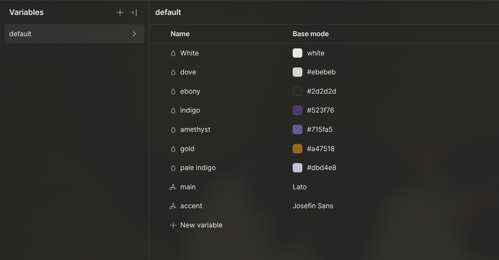

These are for variables, in webflow, you can have variables for fonts, colors,
and a few more stuff, not sure that, (please include future tsp), these
variables are really helpful. Since they allow you to change something about
the web page once without, having to change each and every occurrence of it.

Exercise for adding vars:

Landon Color Scheme

white: #ffffff
ebony: #2d2d2d
dove: #ebebeb
indigo: #523f76
amethyst: #715fa5
gold: #a47518
pale indigo: #dbd4e8

Landon Fonts

main: Lato
accent: Josefin Sans
