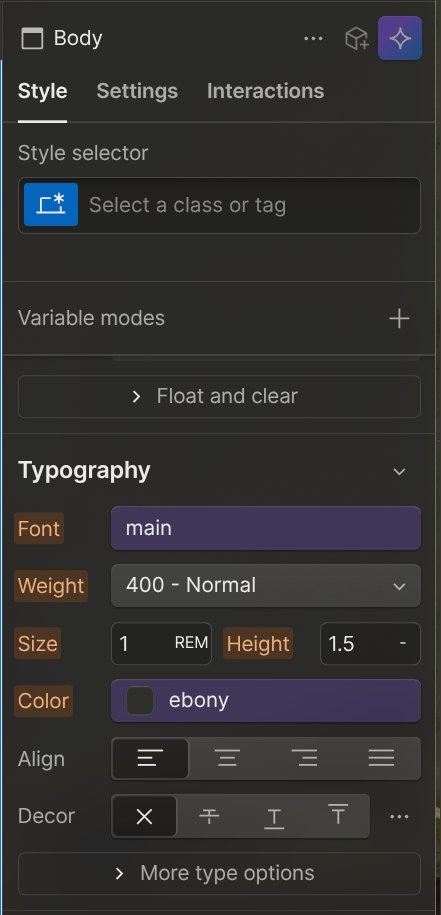

In CSS and Webflow, all the styles cascades down from the parent to the
children. The *body* is the first parent of all web pages.

- Using rem(Root EM): for font size is good, since it is relative to the root
font size of the browser (which is 16px for most browsers). This means that if a
user were to change their browser default size to something else, it would scale
accordingly.
- Using unitless for line-height is nice since it will allow any children
elements to scale accordingly.

- No color means that this is the default for the property.
- Blue means that these are options where the default values have been changed.

Landon Font Sizes

HTML element	Font size	Line Height	Font Family
H1				2.75rem		1.4			accent
H2				2.375rem	1.3			accent
H3				1.875rem	1.5			accent
body			1rem		1.75		main
